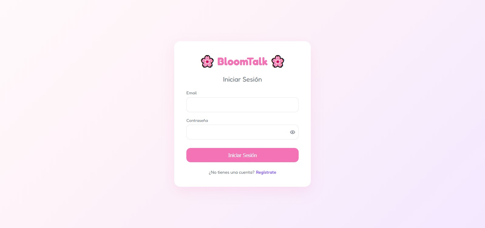
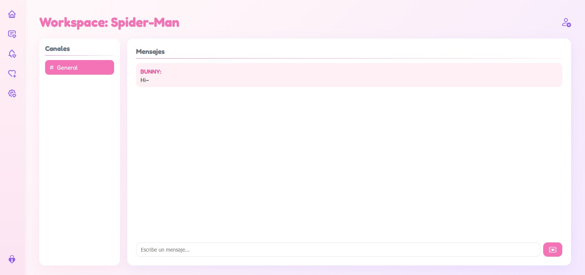
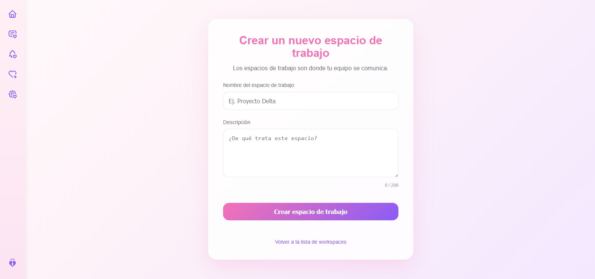

# ︵‿₊⊱🌸 BloomTalk 🌸⊰₊‿︵

Frontend del proyecto **BloomTalk**, un clon de Slack.  
Desarrollado con **React.js**, este frontend permite a los usuarios:

- Registrarse e iniciar sesión.
- Crear y gestionar workspaces.
- Crear y unirse a canales.
- Enviar y recibir mensajes en tiempo real.
- Invitar miembros a los workspaces y asignar roles.

⊹₊ ˚‧︵‿₊୨୧₊‿︵‧ ˚ ₊⊹

## 🛠️ Tecnologías

- React.js (Functional Components, Hooks)
- React Router (navegación)
- CSS Modules / Custom CSS
- Fetch API para comunicación con backend
- react-icons para íconos
- Node.js & npm (para gestión de paquetes)

⊹₊ ˚‧︵‿₊୨୧₊‿︵‧ ˚ ₊⊹

## 📌 Notas importantes

- La aplicación necesita el backend corriendo para funcionar correctamente.
- Los roles y permisos dependen de la lógica del backend.

⊹₊ ˚‧︵‿₊୨୧₊‿︵‧ ˚ ₊⊹

## 🖼️ Capturas de pantalla

**LoginScreen**

**WorkspaceScreen**

**CreateWorkspaceScreen**

⊹₊ ˚‧︵‿₊୨୧₊‿︵‧ ˚ ₊⊹

Muchas gracias por leer! (✿◡‿◡) 🌸˚˖⋆